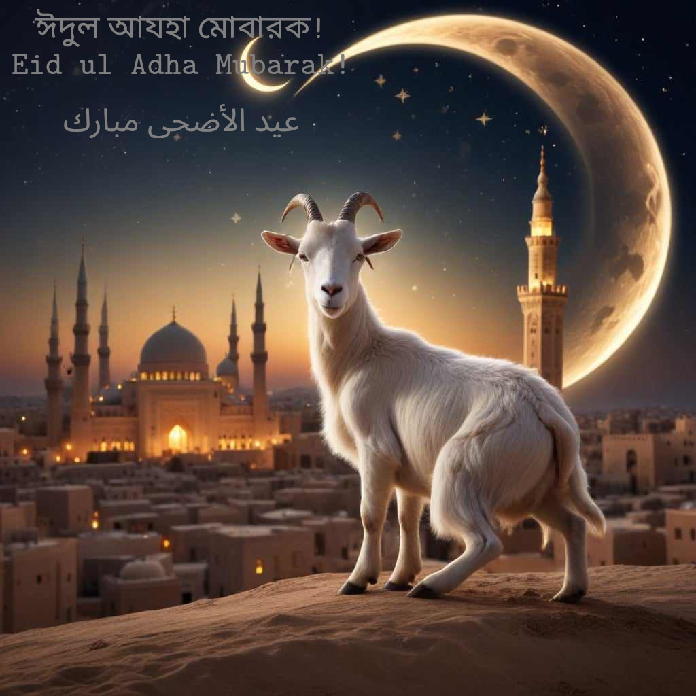

<details>
  <summary>Happy holy Eid ul Adha</summary>
  
  ```
  Sneak View
  ```
  { width=31% }

  ```
  Hello dear there! Me Rashadul Islam ross!
  ```

<details>
        <summary> [ C ] Greeting</summary>

  ```
  English v0.01:
  ```
   > Dear or beloved, at the time of the Holy festival, my warmest greetings to you. Healthy lifestyles, healthy relationships, being safe with others, ethical thinking and altruistic practices will help guide you on your journey. To you at home and abroad, and to all of your loved ones and closest ones, Eid ul Adha Mubarak! #Eid_II #Shared_value #Festival

  ```
  Bengla v0.01:
  ```

   > প্রিয় বা শ্রদ্ধেয়, পবিত্র উত্সবের সময়ে আপনাকে আমার উষ্ণ শুভেচ্ছা। স্বাস্থ্যকর জীবনধারা, স্বাস্থ্যকর সম্পর্ক, অন্যদের নিরাপদ রাখতে নিরাপদ থাকা, মানসম্মত চিন্তাধারা এবং আর্থ-সামাজিক চাকায় অবদান আপনাকে আপনার পথে সাহায্য করুক। দেশে ও বিদেশে আপনাকে, আপনার নিকটতম এবং প্রিয়তম সকলকে ঈদুল আযহা মোবারক! #ঈদ_II #শেয়ার্ড_ভ্যালু #উৎসব

  ```
  French v0.01 :
  ```

   > Cher ou bien-aimé, à l'époque de la Semaine sainte, mes salutations les plus chaleureuses à vous. Des modes de vie sains, des relations saines, la sécurité avec les autres, la pensée éthique et les pratiques altruistes vous guideront dans votre voyage. A vous au pays et à l'étranger, et à tous vos proches et les plus proches, une bonne période de une bonne période de Semaine sainte! #Eid_II #Valeur partagée #Festival


</details>

<details>
    <summary> [ D ] Portrait>

  ```
  Image of mine
  ```
   { width=23% }

</details>

<details>
   <summary> [ E ] How to reach me?</summary>

  ```
  Current
  ```

   | Title      | Address |  Type |
   | :---        |    :----:   |          ---: |
   | Webex      | Gmail: rashadul.cse       | Video call   |
   | Postbox      | Outlook: itsme.rashadul       | Email   |
   | SMS/Pager  | +HH0 AHDA GO ROSS        |  Love to read this      |
   | Cell  | +HH0 AGA DAA HCIE        |  5AM to 11PM EDT      |
   | Venue  | BE.7376062, HI.2598786        |  Come with your friends & family|

</details>

```
Thank you!
```
</details>
